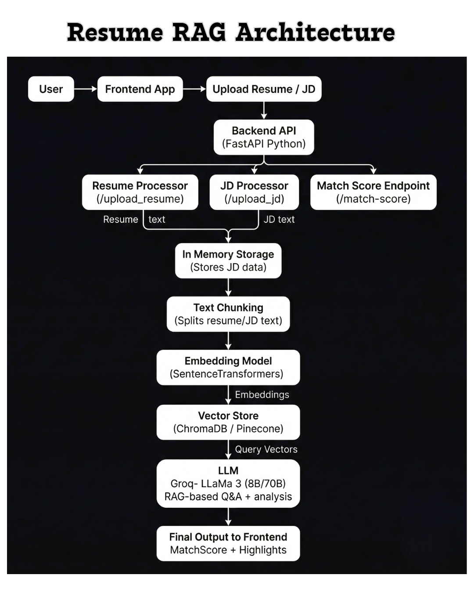

# Resume RAG — AI-Powered Resume Screening System

AI-powered resume screening system built using a **Retrieval-Augmented Generation (RAG)** pipeline with:

* **FastAPI** backend
* **React + Vite** frontend
* **SentenceTransformers** for embeddings
* **ChromaDB (local) / Pinecone (production)** for vector search
* **Groq LLaMA 3** for scoring, explanations, and chat-based reasoning

This system extracts text from resumes & job descriptions → **chunks** → **embeds** → **retrieves semantically relevant segments** → uses **LLM reasoning** to compute an **explainable match score and insights**.

---

## 🔖 Badges


---

## 🖼 System Architecture

<p align="center">
  
</p>

---

## 📑 Table of Contents

* [Features](#-features)
* [Project Structure](#-project-structure)
* [Local Setup](#-local-setup)

  * [Backend Setup](#backend-fastapi)
  * [Frontend Setup](#frontend-react--vite)
* [Design Decisions](#-design-decisions)
* [API Documentation](#-api-documentation)
* [Sample Files](#-sample-files)
* [Deployment](#-deployment)
* [Environment Variables](#-environment-example)
* [Demo Video](#-demo-video)
* [License](#-license)

---

## 🚀 Features

* Upload Resume (PDF / TXT)
* Upload Job Description
* Automatic text extraction → chunking → embedding
* Semantic vector similarity search (ChromaDB / Pinecone)
* Explainable LLM-based scoring (Groq LLaMA 3)
* Highlights **matched skills**, **gaps**, and **category-wise scores**
* Optional RAG-based chat for deeper resume insights

---

## 📂 Project Structure

```
resume-rag-fastapi/
├── backend/
│   ├── main.py                 # FastAPI backend entry point
│   ├── requirements.txt
│   └── .env.example
│
├── frontend/
│   ├── src/
│   │   ├── api/api.ts          # Frontend ↔ Backend API contract
│   │   ├── pages/Home.tsx      # Flow orchestrator
│   │   └── components/         # Upload, MatchScore, Chat
│   ├── public/
│   ├── package.json
│   └── vite.config.js
│
├── assets/
│   └── Architecture.png
│
├── sample_files/
│   ├── sample_resume_1.txt
│   ├── sample_resume_2.txt
│   ├── sample_jd_1.txt
│   └── sample_jd_2.txt
│
├── .gitignore
└── README.md
```

---

## ⚙️ Local Setup

### Backend (FastAPI)

```bash
cd backend
python -m venv venv
venv\Scripts\Activate.ps1      # Windows PowerShell
pip install -r requirements.txt

uvicorn main:app --reload --port 8000
```

Backend runs on **port 8000**:

* API root → [http://localhost:8000](http://localhost:8000)
* Swagger Docs → [http://localhost:8000/docs](http://localhost:8000/docs)

> Swagger provides a live view of backend API contracts and allows testing endpoints independently of the frontend.

---

### Frontend (React + Vite)

```bash
cd frontend
npm install
npm run dev
```

Frontend runs on **port 5173**:

```
http://localhost:5173
```

---

## 🧠 Design Decisions

### 🔍 Resume–JD Matching Strategy

In the current implementation, both the **resume** and **job description** are uploaded and embedded **once**, and their embeddings are stored in a vector database (ChromaDB / Pinecone).

During matching (`/match` endpoint), the frontend sends only the `resume_id` and `jd_id`.
The backend retrieves the corresponding embeddings by ID and computes semantic similarity and rule-based scores **in-memory**.

This design was chosen because:

* The system compares a **specific resume with a specific job description**
* Re-uploading or re-embedding text would be inefficient
* It keeps the frontend lightweight and the API contract clean

> **Note:** An alternative design is to use the job description embedding as a query to rank many resumes (bulk screening use case). This can be added later if the system is extended.

---

## 📘 API Documentation

### POST `/upload_resume`

```bash
file=@resume.pdf
```

**Response**

```json
{
  "status": "success",
  "resume_id": "uuid",
  "chunks": 12
}
```

---

### POST `/upload_jd`

```bash
file=@jd.txt
```

**Response**

```json
{
  "status": "success",
  "jd_id": "uuid",
  "chunks": 8
}
```

---

### POST `/match`

**Request**

```json
{
  "resume_id": "uuid",
  "jd_id": "uuid"
}
```

**Response**

```json
{
  "match_score": "82.4%",
  "strengths": ["React", "REST APIs"],
  "gaps": ["AWS"],
  "insights": "Strong frontend skills but missing cloud exposure."
}
```

---

### POST `/chat`

**Request**

```json
{
  "question": "What skills are missing?",
  "resume_id": "uuid"
}
```

**Response**

```json
{
  "answer": "The candidate lacks AWS deployment experience."
}
```

---

## 🧪 Sample Files

Located in `sample_files/`:

* `sample_resume_1.txt`
* `sample_resume_2.txt`
* `sample_jd_1.txt`
* `sample_jd_2.txt`

---

## 🚀 Deployment

### Backend (Render / Railway / EC2)

Environment variables:

```
GROQ_API_KEY=
PINECONE_API_KEY=
VECTOR_STORE=chroma   # use Pinecone in production
```

Start command:

```bash
uvicorn main:app --host 0.0.0.0 --port $PORT
```

---

### Frontend (Vercel / Netlify)

```
VITE_BACKEND_URL=https://your-backend-url
```

---

## 🧩 Environment Example

```
GROQ_API_KEY=
PINECONE_API_KEY=
VECTOR_STORE=chroma
VITE_BACKEND_URL=http://localhost:8000
```

---

## 🎥 Demo Video

Watch the full demo here:
👉 **Google Drive Link:** [https://drive.google.com/file/d/1AYLtM5yfe1-DQosf_D1tk-jz_OmILHrs/view](https://drive.google.com/file/d/1AYLtM5yfe1-DQosf_D1tk-jz_OmILHrs/view)

---

## 📄 License

MIT License.

---

## 👤 Author

**Abhishek Yogesh**
